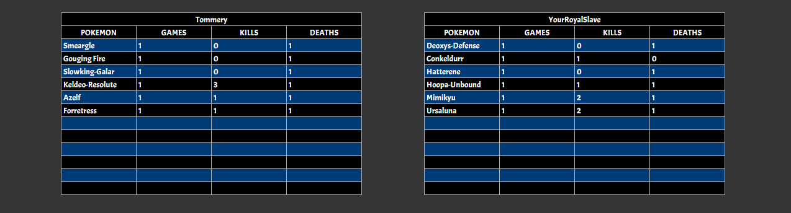

  <h1>Sheet Command</h1>
  

    <a href="https://clodbot.com/analyze" class="command">ANALYZE</a>
    <a href="https://clodbot.com/giveset"  class="command">GIVESET</a>
  

The Sheet Command manipulates information on Google Sheets using a sheets link provided. This includes adding, updating, deleting and listing Pokemon Showdown replay data. Particularly useful for mass tracking of data across different battles in Draft League environments. Keep in mind you would need to have edit permissions on the sheet to be able to use the commands, and would need to undergo an authorization process with an email that has edit permissions (no need for authorization if previous command in the same server was used by the same account) to do so. Make sure that players continuously use the same Pokemon Showdown username for updating information accurately.

### Clodbot, sheet set (Google Sheets Link)

Takes in a Google Sheets link and sets it as the default link for any subsequent sheet commands that use a Google Sheets link besides this one (limited to server) so that the Google Sheets link argument could be skipped. Sends a message with the set sheet name and link after.

<video src="assets/videos/Sheet_Set.mp4" style="width:100%; height:auto; border: 4px solid #005682; border-radius: 15px; box-shadow: 2px 2px 10px rgba(0,0,0,0.5);" autoplay loop muted playsinline></video>

### Clodbot, sheet default

Outputs the current server's default sheet name and link.

<video src="assets/videos/Sheet_Default.mp4" style="width:100%; height:auto; border: 4px solid #005682; border-radius: 15px; box-shadow: 2px 2px 10px rgba(0,0,0,0.5);" autoplay loop muted playsinline></video>

### Clodbot, sheet update (Optional Google Sheets Link) (Pokemon Showdown Replay Link)

Takes in a Google Sheets link (optional if default set) and a Pokemon Showdown replay link and first checks to see if a sheet exists called "Stats" on the Google Sheets link. If not, it creates it. It then updates that sheet with information about both players and the Pokemon used with their games played, kills and deaths. If the player section with their Pokemon Showdown username exists, it updates their section with any new Pokemon and their stats, alongside with adding stats to existing Pokemon from the replay. If the player section does not exist, it creates a new one with the associated information.

<video src="assets/videos/Sheet_Update_NoDefault.mp4" style="width:100%; height:auto; border: 4px solid #005682; border-radius: 15px; box-shadow: 2px 2px 10px rgba(0,0,0,0.5);" autoplay loop muted playsinline></video>
<video src="assets/videos/Sheet_Update_Default.mp4" style="width:100%; height:auto; border: 4px solid #005682; border-radius: 15px; box-shadow: 2px 2px 10px rgba(0,0,0,0.5);" autoplay loop muted playsinline></video>

### Clodbot, sheet list (Optional Google Sheets Link) Players

Takes in a Google Sheets link (optional if default set) and outputs all the players in the "Stats" sheet of the link, in descending order of kills. If multiple players have an equal number of kills, it sorts in ascending order of deaths.

<video src="assets/videos/Sheet_List_Players_NoDefault.mp4" style="width:100%; height:auto; border: 4px solid #005682; border-radius: 15px; box-shadow: 2px 2px 10px rgba(0,0,0,0.5);" autoplay loop muted playsinline></video>
<video src="assets/videos/Sheet_List_Players_Default.mp4" style="width:100%; height:auto; border: 4px solid #005682; border-radius: 15px; box-shadow: 2px 2px 10px rgba(0,0,0,0.5);" autoplay loop muted playsinline></video>

### Clodbot, sheet list (Optional Google Sheets Link) Pokemon

Takes in a Google Sheets link (optional if default set) and outputs all the Pokemon along with the player they belong to in the "Stats" sheet of the link, in descending order of kills. If multiple Pokemon have an equal number of kills, it sorts in ascending order of deaths.

<video src="assets/videos/Sheet_List_Pokemon_NoDefault.mp4" style="width:100%; height:auto; border: 4px solid #005682; border-radius: 15px; box-shadow: 2px 2px 10px rgba(0,0,0,0.5);" autoplay loop muted playsinline></video>
<video src="assets/videos/Sheet_List_Pokemon_Default.mp4" style="width:100%; height:auto; border: 4px solid #005682; border-radius: 15px; box-shadow: 2px 2px 10px rgba(0,0,0,0.5);" autoplay loop muted playsinline></video>

### Clodbot, sheet delete (Optional Google Sheets Link) (Player Name)

Takes in a Google Sheets link (optional if default set) and the username of the Pokemon Showdown player and deletes the entire player section on the Google Sheets Link under the "Stats" sheet if it exists.

<video src="assets/videos/Sheet_Delete_NoDefault.mp4" style="width:100%; height:auto; border: 4px solid #005682; border-radius: 15px; box-shadow: 2px 2px 10px rgba(0,0,0,0.5);" autoplay loop muted playsinline></video>
<video src="assets/videos/Sheet_Delete_Default.mp4" style="width:100%; height:auto; border: 4px solid #005682; border-radius: 15px; box-shadow: 2px 2px 10px rgba(0,0,0,0.5);" autoplay loop muted playsinline></video>