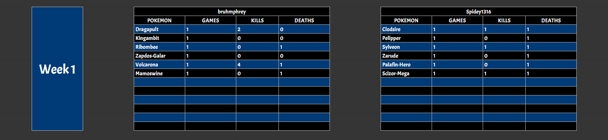

  <h1>Sheet Command</h1>
  

    <a href="https://clodbot.com" class="command">HOME</a>
    <a href="https://clodbot.com/analyze" class="command">ANALYZE</a>
    <a href="https://clodbot.com/giveset"  class="command">GIVESET</a>
  

The Sheet Command manipulates information on Google Sheets using a sheets link provided. This includes adding, updating, deleting and listing Pokemon Showdown replay data. Particularly useful for mass tracking of data across different battles in Draft League environments. Keep in mind you would need to have edit permissions on the sheet to be able to use the commands, and would need to undergo an authorization process with an email that has edit permissions (no need for authorization for any commands with the most recent authorized account) to do so.

### Clodbot, sheet set (Google Sheets Link) (Optional Sheet Name)

Takes in a Google Sheets link and a sheet name (optional, defaults to "Stats") and sets the sheet link and sheet name as the default sheet for any subsequent sheet commands that use a Google Sheets link besides this one (limited to server) so that the Google Sheets link argument could be skipped. Sends a message with the set sheet title and sheet name after.

<video src="assets/videos/Sheet_Set.mp4" style="width:100%; height:auto; border: 4px solid #005682; border-radius: 15px; box-shadow: 2px 2px 10px rgba(0,0,0,0.5);" autoplay loop muted playsinline></video>
<video src="assets/videos/Sheet_Set_Name.mp4" style="width:100%; height:auto; border: 4px solid #005682; border-radius: 15px; box-shadow: 2px 2px 10px rgba(0,0,0,0.5);" autoplay loop muted playsinline></video>

### Clodbot, sheet default

Outputs the current server's default sheet title and sheet name.

<video src="assets/videos/Sheet_Default.mp4" style="width:100%; height:auto; border: 4px solid #005682; border-radius: 15px; box-shadow: 2px 2px 10px rgba(0,0,0,0.5);" autoplay loop muted playsinline></video>

### Clodbot, sheet update (Optional Google Sheets Link) (Optional Sheet Name) (Pokemon Showdown Replay Link) [Optional Week#] (Optional Showdown Name->New Name [Multiple])

Takes in a Google Sheets link (optional if default set), a sheet name (optional, defaults to "Stats"), a Pokemon Showdown replay link, an optional Week Number, and a showdown player name to any name mapping. It first checks to see if the sheet name exists on the Google Sheets link. If not, it creates it. It then updates that sheet with information about both players and the Pokemon used with their games played, kills and deaths. If a week number is specified, it creates a section for that week and fills that section with the appropriate data. If a name mapping is provided, it will use assign the Showdown name as the custom name when filling in the stats.

<video src="assets/videos/Sheet_Update_Default.mp4" style="width:100%; height:auto; border: 4px solid #005682; border-radius: 15px; box-shadow: 2px 2px 10px rgba(0,0,0,0.5);" autoplay loop muted playsinline></video>
<video src="assets/videos/Sheet_Update_NoDefault.mp4" style="width:100%; height:auto; border: 4px solid #005682; border-radius: 15px; box-shadow: 2px 2px 10px rgba(0,0,0,0.5);" autoplay loop muted playsinline></video>
<video src="assets/videos/Sheet_Update_Name.mp4" style="width:100%; height:auto; border: 4px solid #005682; border-radius: 15px; box-shadow: 2px 2px 10px rgba(0,0,0,0.5);" autoplay loop muted playsinline></video>
<video src="assets/videos/Sheet_Update_New.mp4" style="width:100%; height:auto; border: 4px solid #005682; border-radius: 15px; box-shadow: 2px 2px 10px rgba(0,0,0,0.5);" autoplay loop muted playsinline></video>

### Clodbot, sheet list (Optional Google Sheets Link) (Optional Sheet Name) Players

Takes in a Google Sheets link (optional if default set) and a sheet name (optional, defaults to "Stats") and outputs all the players in the sheet name section of the link, in descending order of kills. If multiple players have an equal number of kills, it sorts in ascending order of deaths.

<video src="assets/videos/Sheet_List_Players_Default.mp4" style="width:100%; height:auto; border: 4px solid #005682; border-radius: 15px; box-shadow: 2px 2px 10px rgba(0,0,0,0.5);" autoplay loop muted playsinline></video>
<video src="assets/videos/Sheet_List_Players_NoDefault.mp4" style="width:100%; height:auto; border: 4px solid #005682; border-radius: 15px; box-shadow: 2px 2px 10px rgba(0,0,0,0.5);" autoplay loop muted playsinline></video>
<video src="assets/videos/Sheet_List_Players_Name.mp4" style="width:100%; height:auto; border: 4px solid #005682; border-radius: 15px; box-shadow: 2px 2px 10px rgba(0,0,0,0.5);" autoplay loop muted playsinline></video>

### Clodbot, sheet list (Optional Google Sheets Link) (Optional Sheet Name) Pokemon

Takes in a Google Sheets link (optional if default set) and a sheet name (optional, defaults to "Stats") and outputs all the Pokemon along with the player they belong to in the sheet name section of the link, in descending order of kills. If multiple Pokemon have an equal number of kills, it sorts in ascending order of deaths.

<video src="assets/videos/Sheet_List_Pokemon_Default.mp4" style="width:100%; height:auto; border: 4px solid #005682; border-radius: 15px; box-shadow: 2px 2px 10px rgba(0,0,0,0.5);" autoplay loop muted playsinline></video>
<video src="assets/videos/Sheet_List_Pokemon_NoDefault.mp4" style="width:100%; height:auto; border: 4px solid #005682; border-radius: 15px; box-shadow: 2px 2px 10px rgba(0,0,0,0.5);" autoplay loop muted playsinline></video>
<video src="assets/videos/Sheet_List_Pokemon_Name.mp4" style="width:100%; height:auto; border: 4px solid #005682; border-radius: 15px; box-shadow: 2px 2px 10px rgba(0,0,0,0.5);" autoplay loop muted playsinline></video>

### Clodbot, sheet delete (Optional Google Sheets Link) (Optional Sheet Name) (Player Name)

Takes in a Google Sheets link (optional if default set), a sheet name (optional, defaults to "Stats") and the username of the Pokemon Showdown player and deletes the entire player section on the Google Sheets link under the sheet name if it exists.

<video src="assets/videos/Sheet_Delete_Default.mp4" style="width:100%; height:auto; border: 4px solid #005682; border-radius: 15px; box-shadow: 2px 2px 10px rgba(0,0,0,0.5);" autoplay loop muted playsinline></video>
<video src="assets/videos/Sheet_Delete_NoDefault.mp4" style="width:100%; height:auto; border: 4px solid #005682; border-radius: 15px; box-shadow: 2px 2px 10px rgba(0,0,0,0.5);" autoplay loop muted playsinline></video>
<video src="assets/videos/Sheet_Delete_Name.mp4" style="width:100%; height:auto; border: 4px solid #005682; border-radius: 15px; box-shadow: 2px 2px 10px rgba(0,0,0,0.5);" autoplay loop muted playsinline></video>
